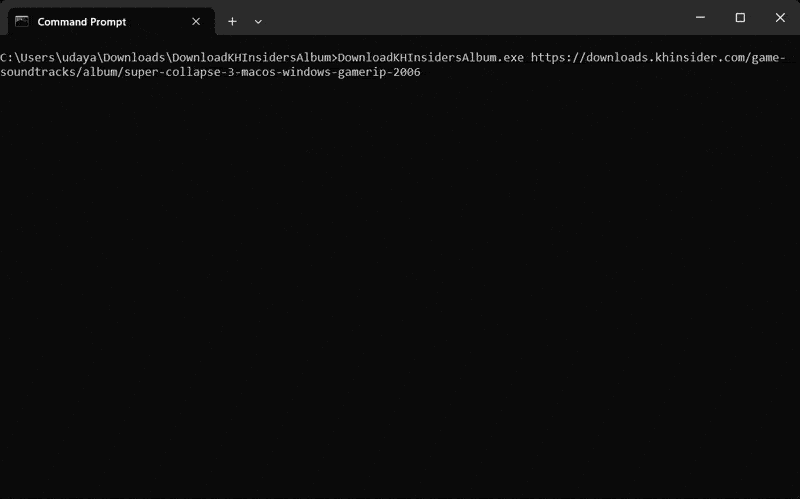

# DownloadKHInsidersAlbum

A console application that lets you download an album from https://downloads.khinsider.com/.

## Requirements

Must have [.NET 10.0+ Runtime](https://dotnet.microsoft.com/en-us/download/dotnet/10.0) installed.

## Introduction

Simply pass the KHInsider's album URL as the first argument to `DownloadKHInsidersAlbum.exe`. You can also optionally specify where to put the music files in the second argument.

For example,

```
DownloadKHInsidersAlbum.exe https://downloads.khinsider.com/game-soundtracks/album/super-collapse-3-macos-windows-gamerip-2006
```



## Usage

```
Usage: DownloadKHInsidersAlbum <AlbumUrl> [OutputDirectory]

Arguments:
  AlbumUrl         The KHInsider's album URL.
  OutputDirectory  The output directory to put the music files.
                   By default, the current directory is used.
```
